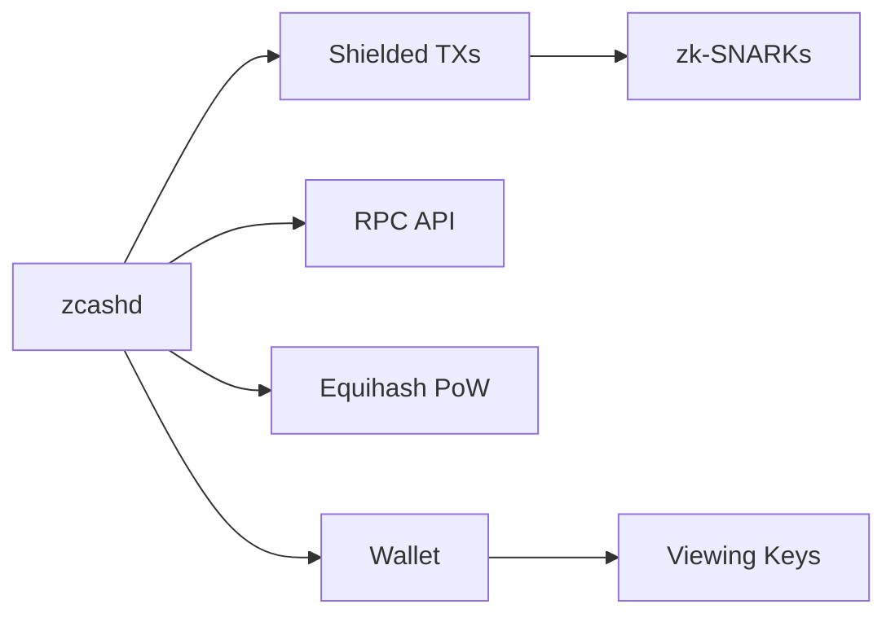

# 🚀 ZOLana: Project Summary

<div align="center">
  <h1>
    <span style="font-size: 3em;">🔒</span>
    <span style="background: linear-gradient(90deg, #8B5CF6, #EC4899, #F59E0B); -webkit-background-clip: text; -webkit-text-fill-color: transparent;">
      ZOLana
    </span>
    <span style="font-size: 3em;">⚡</span>
  </h1>
  <p><strong>Where Zcash Privacy meets Solana Speed</strong></p>
  <p>
    
    
    
    
    
  </p>
</div>

---

## 🌟 Executive Summary

> **ZOLana** is the unholy child of **Zcash's battle-tested zero-knowledge cryptography** and **Solana's rocket-fueled execution** — wrapped in a sleek privacy-first DeFi layer with AI agents watching your back. 🔥

| What | How |
|------|-----|
| 🔐 **Privacy** | Zcash Sapling/Orchard zk-SNARKs (proven since 2016) |
| ⚡ **Speed** | Solana: 400ms blocks, 65K+ TPS, ~$0.00025 fees |
| 🔄 **Swaps** | Jupiter DEX aggregation — best routes across all Solana DEXs |
| 🏗️ **Infrastructure** | Helius RPC, webhooks, DAS API |
| 🤖 **AI Agents** | Intel SGX/AMD SEV Trusted Execution Environments |
| 👛 **Wallets** | Backpack, Phantom, and the custom Dark Wallet |

---

## 🗺️ Repository Atlas

```ascii
┌─────────────────────────────────────────────────────────────────────┐
│                        🌎 ZOLana Ecosystem                          │
├───────────────┬────────────────────────┬────────────────────────────┤
│   🔐 PRIVACY  │   ⚡ SOLANA LAYER      │   🛠️ INFRASTRUCTURE        │
│               │                        │                            │
│  📁 src/      │  📁 dark-protocol/     │  📁 helius-sdk-main/       │
│  Zcash Node   │  Anchor Programs       │  RPC + Webhooks + DAS     │
│               │                        │                            │
│  📁 depends/  │  📁 dark-wallet/       │  📁 backpack-master/      │
│  Build deps   │  React + Vite + TW     │  Coral's Wallet            │
│               │                        │                            │
│  📁 zcutil/   │  📁 darkswap/          │  📁 jupiter-amm-impl/     │
│  Build tools  │  Jupiter Examples      │  AMM Rust SDK              │
├───────────────┴────────────────────────┴────────────────────────────┤
│  📁 build-aux/ │  📁 contrib/  │  📁 doc/  │  📁 qa/  │  📁 test/  │
│  Autotools     │  Debian/Docker│  Manuals  │  RPC QA  │  Linting   │
└─────────────────────────────────────────────────────────────────────┘
```

### 📂 Directory Deep Dive

| Directory | 🔮 Purpose | 📊 Size | 🏷️ Tags |
|-----------|-----------|---------|---------|
| `dark-protocol/` | 🎯 **Core — Solana Anchor programs + TS SDK** | 27 Rust files | `privacy` `solana` `anchor` |
| `src/` | 🏛️ **Zcash full-node (zcashd) C++ daemon** | ~180 source files | `zcash` `c++` `consensus` |
| `dark-wallet/` | 🎨 **Browser-based privacy wallet** | Vite + React + Tailwind | `wallet` `ui` `shielded` |
| `darkswap/` | 🔄 **Jupiter DEX integration reference examples** | 3 sub-projects | `jupiter` `swaps` `reference` |
| `backpack-master/` | 👛 **Backpack wallet monorepo** | Coral's Solana wallet | `wallet` `xNFT` `coral` |
| `helius-sdk-main/` | 🏗️ **Helius Solana SDK** | RPC + Webhooks | `infrastructure` `rpc` |
| `jupiter-amm-impl/` | 🔧 **Jupiter AMM Rust SDK** | 6 crate workspace | `amm` `routing` |
| `paper/` | 📄 **Academic research paper** | Dark Protocol whitepaper | `research` `academic` |
| `depends/` | 📦 **Zcash cross-compilation deps** | 20+ packages | `build` `dependencies` |
| `build-aux/` | 🔨 **GNU Autotools (m4 macros)** | Build system | `autotools` `configure` |
| `contrib/` | 🐳 **Packaging, Docker, CI/CD** | Debian, gitian, ZMQ | `devops` `packaging` |
| `doc/` | 📚 **Documentation & 152 release notes** | Zcash manuals | `docs` `man-pages` |
| `qa/` | ✅ **Quality assurance** | 137 RPC tests | `testing` `qa` |
| `share/` | 🛠️ **Build scripts** | genbuild, rpcuser | `scripts` `build` |
| `zcutil/` | 🔬 **Utilities (AFL, libFuzzer)** | Fuzz + release tools | `fuzzing` `release` |
| `test/` | 🧪 **Linting infrastructure** | Python linters | `lint` `code-quality` |

---

## 🧩 Core Components

### 1. 🏛️ Zcash Full Node (`src/`)
> The beast that powers the privacy engine



- **Shielded transactions** with Sapling + Orchard zk-SNARKs 🛡️
- **Private wallet** with spending/viewing key separation 🔑
- **Equihash PoW** consensus engine ⛏️
- **JSON-RPC API** for programmatic interaction 📡

### 2. 🎯 Dark Protocol (`dark-protocol/`)
> The Solana brain of the operation

**📋 10 Instruction Handlers:**

| # | Instruction | Status | Description |
|---|------------|--------|-------------|
| 1 | `initialize_protocol` | ✅ | Set up protocol state + Merkle tree |
| 2 | `create_shielded_address` | ✅ | Generate Zcash-style Sapling addresses |
| 3 | `shield_tokens` | ✅ | Convert transparent → shielded SOL |
| 4 | `unshield_tokens` | ✅ | Convert shielded → transparent with ZK proof |
| 5 | `private_transfer` | ✅ | Anonymous transfers between shielded addresses |
| 6 | `private_swap` | ✅ | Private swaps via Jupiter routing |
| 7 | `add_to_privacy_pool` | ✅ | Deposit to mixing pool |
| 8 | `remove_from_privacy_pool` | ✅ | Withdraw from mixing pool |
| 9 | `register_ai_agent` | ✅ | Register TEE-secured AI agents |
| 10 | `execute_ai_action` | ✅ | Execute automated trading actions |

**🧬 Cryptographic Modules (25 Rust files):**

```
src/
├── crypto/
│   ├── commitment.rs     🔗 Pedersen commitments
│   ├── nullifier.rs      🚫 Double-spend prevention
│   ├── merkle.rs         🌳 Incremental Merkle trees
│   ├── zk_proof.rs       🧙 Zero-knowledge proofs
│   ├── encryption.rs     🔐 Note encryption
│   ├── sapling.rs        🛡️ Zcash Sapling integration
│   ├── sapling_v2.rs     🔄 Production-ready Sapling
│   ├── note_encryption.rs 📝 ChaCha20-Poly1305 AEAD
│   └── groth16.rs        🎯 Groth16 proving system
├── zcash/
│   ├── sapling.rs        📜 Full Sapling protocol
│   ├── note_encryption.rs 🔐 Zcash note encryption
│   ├── prf.rs            🔑 PRF functions
│   └── zip32.rs          👨‍👩‍👧‍👦 HD wallet derivation
└── integrations/
    └── jupiter.rs         🔄 Jupiter DEX integration
```

### 3. 🎨 Dark Wallet (`dark-wallet/`)
> Beautiful, browser-based privacy 🔒

```
Built with: Vite ⚡ + React ⚛️ + TypeScript 📘 + Tailwind 🎨
Builds clean! ✅ → 725KB gzip output
```

| Feature | Status |
|---------|--------|
| 🔒 Shield tokens | ✅ Component ready |
| 🔓 Unshield tokens | ✅ Component ready |
| ✉️ Private transfer | ✅ Component ready |
| 🔄 Private swap | ✅ Component ready |
| 🤖 AI Agent manager | ✅ Component ready |
| 👛 Wallet adapter | ✅ Backpack, Phantom |

### 4. 🔄 DEX Integration (`darkswap/`)
> Jupiter: the DeFi routing layer

```
darkswap/
├── jupiter-core-example-main/        🦀 Rust AMM core example
├── jupiter-quote-api-node-main/      📡 Node.js quote API example
└── jupiter-swap-api-client-main/     💱 Swap execution example
```

### 5. 🏗️ Infrastructure (`helius-sdk-main/`)
> Enterprise-grade Solana infrastructure

- 📡 RPC endpoints with optimized compute units
- 🚦 Priority fee estimation
- 🔔 Webhook management
- 🎨 DAS (Digital Asset Standard) API

---

## 🏗️ Architecture

```
┌──────────────────────────────────────────────────────────────────────┐
│                         ☁️ ZOLana Cloud                             │
│              AI Agents in TEE (Intel SGX / AMD SEV)                 │
└──────────────────────────────────────────────────────────────────────┘
                                    │
┌──────────────────────────────────────────────────────────────────────┐
│                         🌐 ZOLana Platform                          │
├─────────────────┬─────────────────┬─────────────────┬───────────────┤
│   🔐 Zcash     │    ⚡ Dark      │    🎨 Dark      │   🔄 Jupiter  │
│   Full Node    │    Protocol     │    Wallet       │   Aggregator  │
│   (src/)       │    (Anchor)     │    (Vite)       │   (darkswap/) │
│                 │                 │                 │               │
│  • zk-SNARKs   │  • 10 Programs  │  • Shield UI    │  • Route Opt  │
│  • Shielded TXs│  • Merkle Tree  │  • Transfer UI  │  • Multi-hop  │
│  • View Keys   │  • Nullifiers   │  • Swap UI      │  • Slippage   │
│  • Wallet      │  • ZK Proofs    │  • AI Manager   │  • MEV Protect│
└─────────────────┴─────────────────┴─────────────────┴───────────────┘
┌──────────────────────────────────────────────────────────────────────┐
│                         🛠️ Infrastructure Layer                     │
│                                                                      │
│  📡 Helius SDK  │  👛 Backpack Wallet  │  🔗 Solana RPC             │
│  (RPC/WEBHOOKS)  │  (xNFT/CROSS-CHAIN)  │  (400ms BLOCKS)           │
└──────────────────────────────────────────────────────────────────────┘
```

---

## ⚡ Performance & Specs

| Metric | Value |
|--------|-------|
| 🔄 Private TX throughput | ~1,500 TPS |
| 🤖 AI Agent response time | <1 second |
| 🔒 Private swap latency | ~800ms (2-3 blocks) |
| 💰 Shielded balance size | 128 bytes (ElGamal) |
| 🧙 ZK Proof size | 256 bytes (Groth16) |
| 📝 Note data size | ~700 bytes (Sapling) |
| ⛽ Transaction fee | ~$0.00025 |

---

## 🎯 Roadmap

```ascii
PHASE 1: FOUNDATION 🏛️        PHASE 2: ADVANCED CRYPTO 🧙
┌─────────────────────────┐   ┌─────────────────────────┐
│ ✅ Zcash port           │   │ [ ] Groth16 full impl   │
│ ✅ Solana programs      │   │ [ ] Threshold ElGamal   │
│ ✅ TS SDK scaffold      │   │ [ ] Privacy pools       │
│ ✅ React components     │   │ [ ] Ephemeral accounts  │
│ ✅ Jupiter integration  │   │ [ ] eAsset system       │
│ ✅ AI agent framework   │   │                         │
└─────────────────────────┘   └─────────────────────────┘

PHASE 3: PRODUCTION 🚀        PHASE 4: EXPANSION 🌍
┌─────────────────────────┐   ┌─────────────────────────┐
│ [ ] Security audits     │   │ [ ] Cross-chain bridge  │
│     Trail of Bits       │   │ [ ] Mobile wallet       │
│     Zellic              │   │ [ ] Governance system   │
│     OtterSec            │   │ [ ] Hardware wallets    │
│     Neodyme             │   │ [ ] Private DeFi suite  │
│ [ ] Formal verification │   │                         │
│ [ ] Performance tuning  │   │                         │
│ [ ] Mainnet deploy 🚀   │   │                         │
└─────────────────────────┘   └─────────────────────────┘
```

---

## 🧪 Building The Beast

### Prerequisites

```bash
# 🦀 Install Rust
curl --proto '=https' --tlsv1.2 -sSf https://sh.rustup.rs | sh

# ⚡ Install Solana CLI
sh -c "$(curl -sSfL https://release.solana.com/stable/install)"

# 🏗️ Install Anchor
cargo install --git https://github.com/coral-xyz/anchor avm --locked --force
avm install 0.30.0 && avm use 0.30.0
```

### 🔨 Build

```bash
# 📦 Dark Protocol — Solana programs (Anchor)
cd dark-protocol && anchor build
# ✅ Compiles with release profile
# ⚠️ 58 warnings (mostly unused vars in Zcash crypto code)

# 🎨 Dark Wallet — Frontend
cd dark-wallet && npm install && npm run dev
# ✅ Builds clean! 5397 modules → ~725KB gzip
# 🚀 Ready at http://localhost:5173
```

### 💻 SDK Quickstart

```typescript
import { DarkProtocolClient } from '@dark-protocol/sdk';
import { Connection } from '@solana/web3.js';

const connection = new Connection('https://api.devnet.solana.com');
const client = new DarkProtocolClient(connection, wallet);

// 🛡️ Shield tokens
const { commitment, nullifier } = await client.generateNoteCommitment(
  amount, wallet.publicKey
);
await client.shieldTokens({ amount, commitment, nullifier });

// ✉️ Private transfer
await client.privateTransfer({
  recipient, amount,
  memo: "🤫 This is our secret"
});
```

---

## 👛 Wallet Integration

```
✅ Backpack     — Full Solana xNFT wallet
✅ Phantom      — Most popular Solana wallet
✅ Wallet Adapter Standard — Any Solana wallet
```

---

## 🛡️ Security Model

| Layer | Protection |
|-------|-----------|
| 🔐 **Cryptographic** | ZK-SNARKs (soundness), Pedersen commitments, ChaCha20-Poly1305 AEAD |
| 💰 **Economic** | MEV resistance via private order flow, slippage protection, rate limiting |
| ⚙️ **Operational** | TEE attestation (Intel SGX/AMD SEV), multi-sig governance, circuit breaker |
| 🧪 **Audit pipeline** | Trail of Bits, Zellic, OtterSec, Neodyme (planned) |

---

## 🤝 Community

```ascii
  💬 Discord → discord.gg/dark-protocol
  🐦 Twitter → @DarkProtocol
  📖 Docs    → docs.dark-protocol.io  
  🌐 Web     → dark-protocol.io
  💻 Code    → github.com/Solizardking/ZOLana
```

---

## 📜 License

```
Apache 2.0 — Go build something private. 🦾
```

---

<div align="center">
  <h2>
    <span style="font-size: 2em;">🔒</span>
    Privacy is a right, not a privilege.
    <span style="font-size: 2em;">⚡</span>
  </h2>
  <p><strong>Build the future with ZOLana.</strong></p>
  <p><em>Last updated: June 10, 2026</em></p>
</div>
